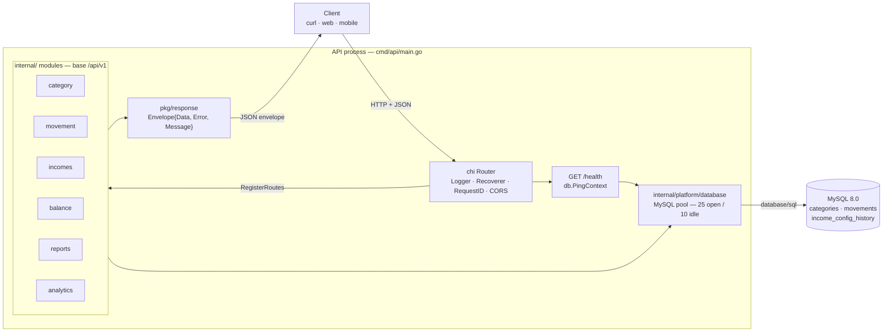
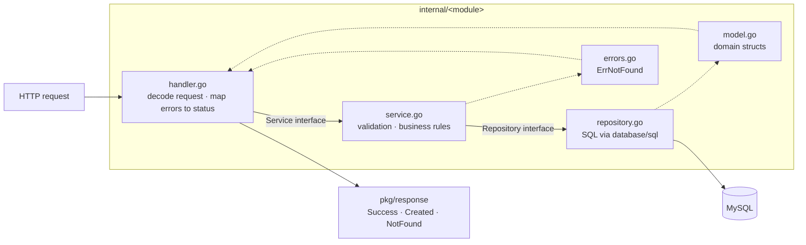
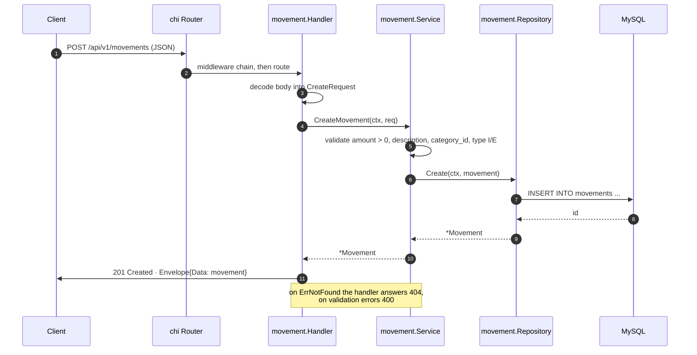
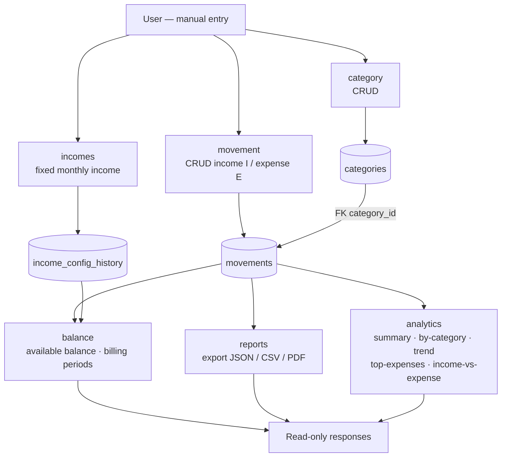
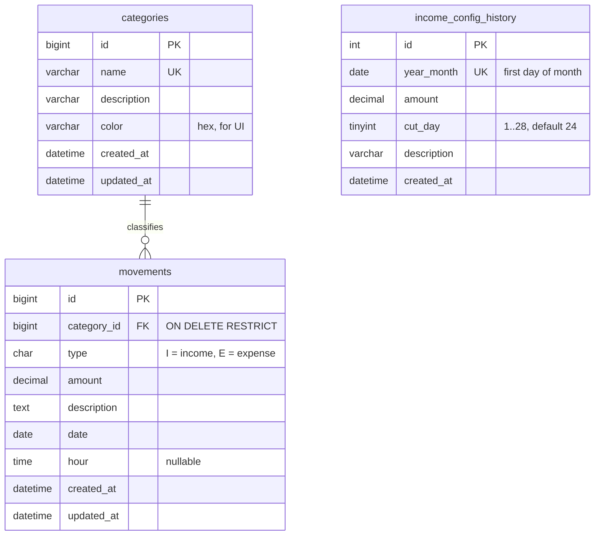

# MyBasics-Expenses — API de Finanzas Personales

API en Go para llevar el control de tus finanzas personales. **Tú registras cada
movimiento manualmente** (ingreso o gasto); la API los agrupa por categoría y los
convierte en balances, reportes y analíticas.

> Este proyecto es una versión simplificada de MyExpenses: **no incluye ingesta
> automática de correos**. Todos los movimientos los crea el usuario vía API.

---

## Stack

- **Go 1.23** · router [chi](https://github.com/go-chi/chi) · `database/sql` + `go-sql-driver/mysql`
- **MySQL 8.0** (Docker)
- Patrón por capas **Repository → Service → Handler**
- Módulo Go: `github.com/jscodelab/mybasics-expenses`

---

## Estructura

```
mybasics-expenses/
├── cmd/api/main.go            # Punto de entrada y wiring
├── internal/
│   ├── category/              # Categorías        (model, repository, service, handler)
│   ├── movement/              # Movimientos I/E   (model, repository, service, handler)
│   ├── incomes/              # Config de ingreso fijo (versionado)
│   ├── balance/              # Balance disponible y periodos de corte
│   ├── reports/              # Exportación de datos
│   ├── analytics/            # Agregaciones y tendencias
│   └── platform/database/    # Factory de conexión MySQL
├── pkg/response/             # Helpers de respuesta (Envelope)
├── migrations/001_init.sql   # Esquema definitivo + seed base
├── docker-compose.yml
└── Dockerfile
```

---

## Architecture diagrams

### 1. Component overview



### 2. Layered pattern inside a module

Every module under `internal/` repeats the same three layers, and each layer is
defined as an interface so the layer above can be unit-tested with a mock.



### 3. Request lifecycle — `POST /api/v1/movements`



### 4. Module dependencies and data flow

`movements` is the single source of truth: `balance`, `reports` and `analytics`
never write, they only aggregate what the user recorded manually.



> `balance` is the only module wired with two repositories: its own plus
> `incomes`, because the available balance needs the fixed income and its cut day
> (see the wiring in `cmd/api/main.go`).

### 5. Data model



`income_config_history` is versioned rather than updated in place: each row is
valid from its `year_month` forward until a newer row exists, so past balances
stay reproducible.

---

## Puesta en marcha

### Opción A — Local

```bash
cp .env.example .env          # ajusta credenciales de tu MySQL
docker compose up db          # levanta solo la base de datos
go run ./cmd/api/...          # levanta el API
```

El API queda en **http://localhost:8080**.

### Opción B — Docker Compose (MySQL + API)

```bash
docker compose up --build
```

Aquí el API queda en **http://localhost:8081** y la base en el puerto `3308`.
La migración `migrations/001_init.sql` se ejecuta automáticamente en el primer
arranque: crea las tablas `categories`, `movements`, `income_config_history`,
siembra categorías base y **ningún movimiento de ejemplo** (empiezas limpio).

---

## Variables de entorno

| Variable      | Default   | Descripción            |
|---------------|-----------|------------------------|
| `PORT`        | `8080`              | Puerto del API         |
| `DB_HOST`     | `localhost`         | Host de MySQL          |
| `DB_PORT`     | `3306`              | Puerto de MySQL        |
| `DB_USER`     | `root`              | Usuario de MySQL       |
| `DB_PASSWORD` | *(vacío)*           | Contraseña de MySQL    |
| `DB_NAME`     | `mybasics_expenses` | Nombre de la base      |

---

## GitHub MCP integration

`.mcp.json` declares the GitHub MCP server that Claude Code uses to operate on
this repository's issues and pull requests.

The token is **never committed**: the file references `${GITHUB_PERSONAL_ACCESS_TOKEN}`,
which Claude Code expands from the environment of the shell that launched it.
Export the real value in your profile (`~/.zshrc`, `~/.bashrc`) before starting
Claude Code:

```bash
export GITHUB_PERSONAL_ACCESS_TOKEN="github_pat_..."
```

A `.env` file will **not** work here: the Go app reads it, but the MCP process
does not. Verify the connection with `claude mcp list`.

---

## Endpoints

Base URL: `http://localhost:8080/api/v1`

### Autenticación

La API usa **sesiones del lado del servidor** (cookie `session`, store en MySQL vía
`alexedwards/scs`). El flujo es: registrar un usuario, iniciar sesión, y usar la
cookie recibida en las peticiones a los endpoints protegidos.

| Método | Ruta            | Auth       | Descripción                                            |
|--------|-----------------|------------|--------------------------------------------------------|
| POST   | `/user`         | Pública    | Registra un usuario (contraseña con bcrypt, nunca en claro) |
| POST   | `/user/login`   | Pública    | Inicia sesión; guarda el `id` del usuario en la sesión y devuelve la cookie |
| POST   | `/user/logout`  | Requiere sesión | Cierra la sesión actual (la destruye y expira la cookie) |

**Registro** — body `{ "username", "name", "email", "password" }`.
`password` debe tener entre 8 y 72 caracteres. `username` y `email` son únicos.

**Login** — body `{ "email", "password" }`. Respuesta `200` + cookie `session`
(`HttpOnly`). Credenciales inválidas → `401`.

**Logout** — sin body, envía la cookie de sesión. Respuesta `200`. Destruye la
sesión asociada a **esa** cookie (identificada por su token, no por el `id` del
usuario), por lo que sólo cierra la sesión de ese dispositivo. Sin sesión → `401`.

**Endpoints protegidos** — todo lo que está bajo `/api/v1` **excepto** `/user` y
`/user/login` requiere una sesión válida. Sin cookie → `401 {"error":"not authenticated"}`.
Cada petición se filtra por el usuario autenticado: los movimientos, el balance, la
config de ingreso, los reportes y la analítica sólo devuelven datos de ese usuario.
Las **categorías son compartidas** entre todos los usuarios.

### Categorías
| Método | Ruta                  | Descripción                     |
|--------|-----------------------|---------------------------------|
| GET    | `/categories`         | Lista categorías                |
| POST   | `/categories`         | Crea una categoría              |
| GET    | `/categories/{id}`    | Obtiene una categoría           |
| PUT    | `/categories/{id}`    | Edita una categoría             |
| DELETE | `/categories/{id}`    | Elimina una categoría           |

### Movimientos
| Método | Ruta                     | Descripción                                      |
|--------|--------------------------|--------------------------------------------------|
| POST   | `/movements`             | Crea un movimiento (`type` `I`=ingreso, `E`=gasto) |
| GET    | `/movements`             | Lista movimientos agrupados por categoría         |
| GET    | `/movements/expenses`    | Lista plana de gastos (`?limit=&date_from=&date_to=`) |
| GET    | `/movements/summary`     | Totales de gasto por mes                          |
| GET    | `/movements/{id}`        | Obtiene un movimiento                             |
| PUT    | `/movements/{id}`        | Edita un movimiento                              |
| DELETE | `/movements/{id}`        | Elimina un movimiento                            |

Filtros de `GET /movements`: `category_id`, `type`, `date_from`, `date_to`, `limit`.

> Todos los endpoints de Movimientos, Ingreso fijo, Balance, Reportes y Analítica
> están **protegidos**: requieren la cookie de sesión y están acotados al usuario
> autenticado. El `user_id` **no** se envía en el body ni en la query — se toma de
> la sesión.

### Ingreso fijo, balance, reportes y analítica
| Método | Ruta                             | Descripción                            |
|--------|----------------------------------|----------------------------------------|
| GET    | `/incomes/config`                | Config de ingreso fijo vigente         |
| PUT    | `/incomes/config`                | Crea/actualiza el ingreso fijo         |
| GET    | `/balance`                       | Balance disponible                     |
| GET    | `/balance/periods`               | Balance por periodo de corte           |
| GET    | `/reports/export`                | Exporta los datos                      |
| GET    | `/analytics/summary`             | Resumen general                        |
| GET    | `/analytics/by-category`         | Gasto por categoría                    |
| GET    | `/analytics/trend`               | Tendencia temporal                     |
| GET    | `/analytics/top-expenses`        | Mayores gastos                         |
| GET    | `/analytics/income-vs-expense`   | Ingreso vs gasto                       |

---

## Ejemplos con curl

Registrar un usuario:

```bash
curl -s -X POST http://localhost:8080/api/v1/user \
  -H "Content-Type: application/json" \
  -d '{"username": "john", "name": "John Doe", "email": "john@example.com", "password": "supersecret"}' | jq .
```

Iniciar sesión y guardar la cookie de sesión en `cookies.txt`:

```bash
curl -s -c cookies.txt -X POST http://localhost:8080/api/v1/user/login \
  -H "Content-Type: application/json" \
  -d '{"email": "john@example.com", "password": "supersecret"}' | jq .
```

A partir de aquí, las peticiones protegidas usan la cookie con `-b cookies.txt`.

Crear un gasto:

```bash
curl -s -b cookies.txt -X POST http://localhost:8080/api/v1/movements \
  -H "Content-Type: application/json" \
  -d '{
    "category_id": 1,
    "type": "E",
    "amount": 42500,
    "description": "Mercado de la semana",
    "date": "2026-07-15",
    "hour": "10:30"
  }' | jq .
```

Registrar un ingreso:

```bash
curl -s -b cookies.txt -X POST http://localhost:8080/api/v1/movements \
  -H "Content-Type: application/json" \
  -d '{"category_id": 11, "type": "I", "amount": 3000000, "description": "Salario", "date": "2026-07-01"}' | jq .
```

Listar movimientos agrupados por categoría (del usuario en sesión):

```bash
curl -s -b cookies.txt http://localhost:8080/api/v1/movements | jq .
```

Fijar el ingreso mensual:

```bash
curl -s -b cookies.txt -X PUT http://localhost:8080/api/v1/incomes/config \
  -H "Content-Type: application/json" \
  -d '{"amount": 3000000, "cut_day": 24}' | jq .
```

---

## Formato de respuesta

Todas las respuestas se envuelven en un `Envelope`:

```json
{
  "data": { "...": "..." },
  "error": null,
  "message": "optional"
}
```

Los handlers **siempre** usan los helpers de `pkg/response` (`Success`, `Created`,
`NotFound`, …) — nunca escriben JSON crudo.

---

## Health check

```bash
curl -i http://localhost:8080/health
```

Responde `200 {"status":"ok"}` si la base responde, o `503 {"status":"degraded"}`.

---

## Cómo agregar un módulo nuevo

1. Crear `internal/<nombre>/` con `model.go`, `repository.go`, `service.go`, `handler.go`
   siguiendo el patrón de `movement/`.
2. Definir interfaces en cada capa (permite mocks en tests).
3. Registrar rutas con `RegisterRoutes(r)` y hacer el wiring en `cmd/api/main.go`.
4. Agregar tests de servicio con un mock inline del repositorio.
